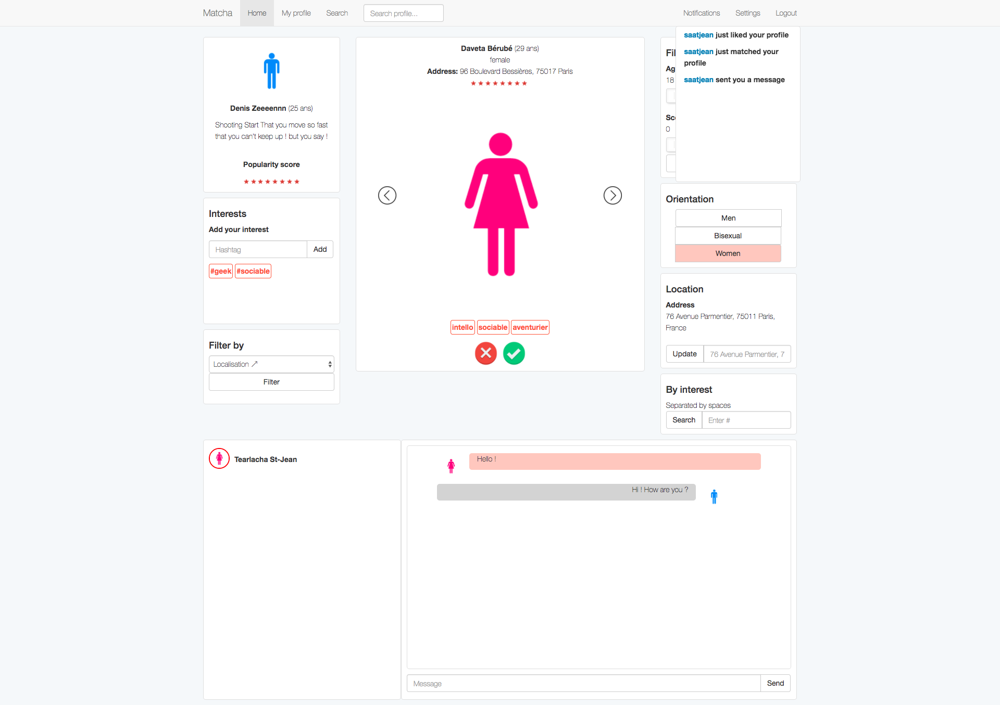
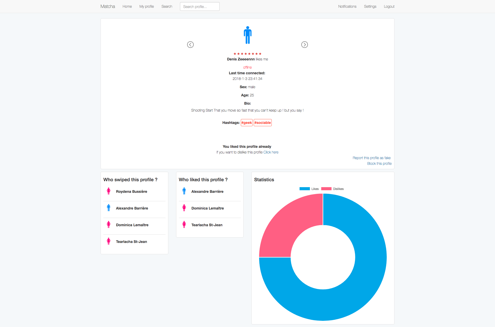

# Matcha

## Introduction
Dating Website made by 42 Students using: <br/>
* Node.js
* Express.js
* Socket.io
* MongoDB
* EJS Template
* Bootstrap

## Installation

### Install dependencies
Before installing make sure you have installed [Node.js](https://nodejs.org/en/).
``` shell
$ npm install
```

### Import users into database using MongoDB
Before entering all the commands below, make sure [MongoDB](https://www.mongodb.com/download-center?ct=atlasheader#community) is installed
``` shell
$ mkdir /*PROJECT_PATH*/database && ./mongod --dbpath /*PROJECT_PATH*/database/

Another Shell Window
$ ./mongoimport --db matcha --collection users --drop --file /*PROJECT_PATH*/public/dump/users.json
$ ./mongoimport --db matcha --collection views --drop --file /*PROJECT_PATH*/public/dump/views.json
$ ./mongo
$ use matcha
$ db.users.createIndex({location: "2dsphere"})
```
### Start 
``` shell
$ npm start
```

## Screenshots
### Homepage 
<p align="center">
  
</p>

### Profile Page
<p>
  
</p>
